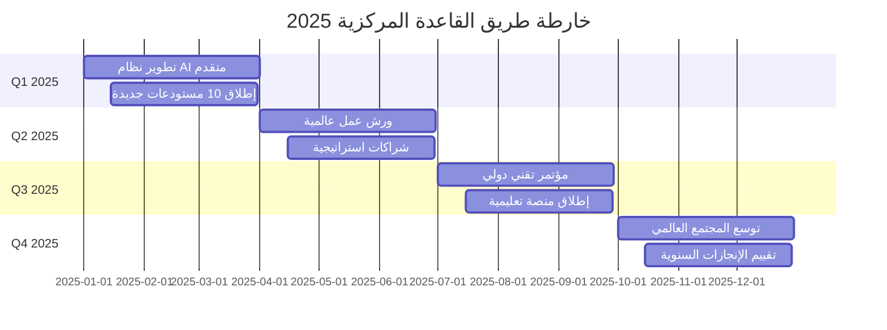

<div align="center">

# 🏰 القاعدة المركزية - asrar-mared HQ


[](https://git.io/typing-svg)

<p align="center">
  
  
  
  
</p>


</div>

---

## 🎯 مرحباً بك في القيادة المركزية

<div align="center">

```ascii
╔═══════════════════════════════════════════════════════════════════════╗
║                                                                       ║
║     █████╗ ███████╗██████╗  █████╗ ██████╗     ███╗   ███╗ █████╗   ║
║    ██╔══██╗██╔════╝██╔══██╗██╔══██╗██╔══██╗    ████╗ ████║██╔══██╗  ║
║    ███████║███████╗██████╔╝███████║██████╔╝    ██╔████╔██║███████║  ║
║    ██╔══██║╚════██║██╔══██╗██╔══██║██╔══██╗    ██║╚██╔╝██║██╔══██║  ║
║    ██║  ██║███████║██║  ██║██║  ██║██║  ██║    ██║ ╚═╝ ██║██║  ██║  ║
║    ╚═╝  ╚═╝╚══════╝╚═╝  ╚═╝╚═╝  ╚═╝╚═╝  ╚═╝    ╚═╝     ╚═╝╚═╝  ╚═╝  ║
║                                                                       ║
║               🏰 القاعدة الأم لجميع المشاريع والابتكارات              ║
║                                                                       ║
╚═══════════════════════════════════════════════════════════════════════╝
```

</div>

<div align="right">

### 📜 نبذة عن القاعدة المركزية

هذه هي **القاعدة الأم** 🏰 - المركز الرقمي الذي يجمع جميع مشاريعنا، مستودعاتنا، فرقنا، ومؤسساتنا تحت سقف واحد. من هنا تبدأ رحلة الابتكار، ومن هنا ننطلق لبناء المستقبل الرقمي.

</div>

---

## 🌐 خريطة القاعدة المركزية التفاعلية

```mermaid
graph TB
    A[🏰 القاعدة المركزية<br/>asrar-mared HQ] --> B[🔐 قسم الأمن السيبراني]
    A --> C[🤖 قسم الذكاء الاصطناعي]
    A --> D[🌐 قسم تطوير الويب]
    A --> E[📱 قسم تطوير التطبيقات]
    A --> F[🗄️ قسم قواعد البيانات]
    A --> G[☁️ قسم الحوسبة السحابية]
    
    B --> B1[🕷️ Honeytrap Systems]
    B --> B2[🛡️ Security Tools]
    B --> B3[🔍 Forensics Apps]
    
    C --> C1[🧠 ML Models]
    C --> C2[📊 Data Analytics]
    C --> C3[🤖 AI Bots]
    
    D --> D1[⚛️ React Projects]
    D --> D2[🟢 Node.js APIs]
    D --> D3[🎨 Frontend Templates]
    
    E --> E1[📱 Mobile Apps]
    E --> E2[🖥️ Desktop Apps]
    E --> E3[🎮 Game Dev]
    
    F --> F1[🐘 PostgreSQL]
    F --> F2[🍃 MongoDB]
    F --> F3[🔴 Redis]
    
    G --> G1[☁️ AWS Projects]
    G --> G2[🔷 Azure Services]
    G --> G3[🐳 Docker Images]
    
    style A fill:#ff6b6b,stroke:#c92a2a,stroke-width:4px,color:#fff
    style B fill:#4c6ef5,stroke:#364fc7,stroke-width:3px,color:#fff
    style C fill:#51cf66,stroke:#2f9e44,stroke-width:3px,color:#fff
    style D fill:#ff922b,stroke:#e67700,stroke-width:3px,color:#fff
    style E fill:#cc5de8,stroke:#9c36b5,stroke-width:3px,color:#fff
    style F fill:#ffd43b,stroke:#fab005,stroke-width:3px,color:#000
    style G fill:#22b8cf,stroke:#0c8599,stroke-width:3px,color:#fff
```

<div align="center">



</div>

---

## 📊 إحصائيات القاعدة المركزية الحية

<div align="center">

### 🔥 لوحة التحكم الرئيسية

<table>
<tr>
<td align="center">

</td>
<td align="center">

</td>
</tr>
<tr>
<td align="center" colspan="2">

</td>
</tr>
</table>

### 🏆 جوائز وإنجازات القاعدة


### 📈 توزيع اللغات البرمجية


</div>

---

## 🏢 المؤسسات والفرق

<div align="center">

<table>
<tr>
<td align="center" width="25%">


### 🛡️ فريق الأمن
**Security Team**


[🔗 استكشف المشاريع](#)

</td>
<td align="center" width="25%">


### 🤖 فريق AI
**AI/ML Team**


[🔗 استكشف المشاريع](#)

</td>
<td align="center" width="25%">


### 💻 فريق التطوير
**Development Team**


[🔗 استكشف المشاريع](#)

</td>
<td align="center" width="25%">


### ☁️ فريق DevOps
**DevOps Team**


[🔗 استكشف المشاريع](#)

</td>
</tr>
</table>

</div>

---

## 🗂️ أقسام المستودعات الرئيسية

<div align="center">

### 🔐 قسم الأمن السيبراني

<table>
<tr>
<td width="50%">

#### 🕷️ Honeytrap & Intrusion Detection
[](https://github.com/asrar-mared/honeytrap-systems)

**الوصف:** نظام فخاخ ذكي متعدد الطبقات مع AI للكشف التلقائي


**التقنيات:**
```yaml
Python | TensorFlow | Network Security | ML
```

</td>
<td width="50%">

#### 🛡️ Security Automation Tools
[](https://github.com/asrar-mared/security-automation)

**الوصف:** مجموعة أدوات أمنية لأتمتة الفحوصات والتحليل


**التقنيات:**
```yaml
Python | Bash | Nmap | Metasploit
```

</td>
</tr>
<tr>
<td width="50%">

#### 🔍 Digital Forensics Toolkit
[](https://github.com/asrar-mared/forensics-toolkit)

**الوصف:** أدوات متقدمة للتحليل الجنائي الرقمي


**التقنيات:**
```yaml
Python | Volatility | Autopsy | Sleuth Kit
```

</td>
<td width="50%">

#### 📡 Network Monitoring Suite
[](https://github.com/asrar-mared/network-monitor)

**الوصف:** نظام مراقبة الشبكات في الوقت الفعلي


**التقنيات:**
```yaml
Wireshark | Snort | ELK Stack | Grafana
```

</td>
</tr>
</table>

---

### 🤖 قسم الذكاء الاصطناعي

<table>
<tr>
<td width="50%">

#### 🧠 ML Security Models
[](https://github.com/asrar-mared/ml-security-models)

**الوصف:** نماذج تعلم آلي للكشف عن التهديدات الأمنية


**التقنيات:**
```yaml
Python | TensorFlow | Scikit-learn | Keras
```

</td>
<td width="50%">

#### 📊 Data Analytics Platform
[](https://github.com/asrar-mared/data-analytics)

**الوصف:** منصة تحليل البيانات الضخمة والتنبؤات


**التقنيات:**
```yaml
Python | Pandas | Apache Spark | Jupyter
```

</td>
</tr>
</table>

---

### 🌐 قسم تطوير الويب

<table>
<tr>
<td width="50%">

#### ⚛️ React Modern Dashboard
[](https://github.com/asrar-mared/react-dashboard)

**الوصف:** لوحة تحكم حديثة بتصميم Material-UI


**التقنيات:**
```yaml
React | Material-UI | Redux | TypeScript
```

</td>
<td width="50%">

#### 🟢 Node.js REST API
[](https://github.com/asrar-mared/nodejs-api)

**الوصف:** API متقدم مع JWT والتوثيق الكامل


**التقنيات:**
```yaml
Node.js | Express | MongoDB | JWT
```

</td>
</tr>
</table>

---

### ☁️ قسم الحوسبة السحابية

<table>
<tr>
<td width="50%">

#### 🐳 Docker Compose Collection
[](https://github.com/asrar-mared/docker-collection)

**الوصف:** مجموعة Docker Compose للخدمات المختلفة


**التقنيات:**
```yaml
Docker | Kubernetes | Docker Compose
```

</td>
<td width="50%">

#### ☁️ AWS Infrastructure
[](https://github.com/asrar-mared/aws-infrastructure)

**الوصف:** بنية تحتية كاملة على AWS مع Terraform


**التقنيات:**
```yaml
AWS | Terraform | CloudFormation | Lambda
```

</td>
</tr>
</table>

</div>

---

## 👥 المساهمون في القاعدة المركزية

<div align="center">

### 🌟 نجوم المساهمة

<a href="https://github.com/asrar-mared/asrar-mared/graphs/contributors">
  
</a>

### 📊 إحصائيات المساهمين

<table>
<tr>
<td align="center">


**50+**

مطور نشط
</td>
<td align="center">


**10K+**

Commit
</td>
<td align="center">


**500+**

Pull Request
</td>
<td align="center">


**200+**

Issue محلول
</td>
</tr>
</table>

### 🏆 أبرز المساهمين

<table>
<tr>
<td align="center" width="20%">
<br/>
<b>المطور الرئيسي</b><br/>
<sub>@asrar-mared</sub><br/>

</td>
<td align="center" width="20%">
<br/>
<b>مطور الأمان</b><br/>
<sub>@security-dev</sub><br/>

</td>
<td align="center" width="20%">
<br/>
<b>خبير AI</b><br/>
<sub>@ai-specialist</sub><br/>

</td>
<td align="center" width="20%">
<br/>
<b>مطور Frontend</b><br/>
<sub>@frontend-dev</sub><br/>

</td>
<td align="center" width="20%">
<br/>
<b>DevOps Engineer</b><br/>
<sub>@devops-eng</sub><br/>

</td>
</tr>
</table>

</div>

---

## 🛠️ مجموعة التقنيات المستخدمة

<div align="center">

### 💻 لغات البرمجة


### 🎨 Frontend Development


### ⚙️ Backend Development


### 🗄️ قواعد البيانات


### 🤖 الذكاء الاصطناعي والتعلم الآلي


### ☁️ الحوسبة السحابية و DevOps


### 🔐 أدوات الأمن السيبراني


### 🛠️ أدوات التطوير


</div>

---

## 🎬 عروض فيديو المشاريع

<div align="center">

### 📺 جولة في القاعدة المركزية

<table>
<tr>
<td align="center" width="33%">

[](https://youtube.com)


**مدة الفيديو: 15 دقيقة**

شرح شامل لجميع المشاريع والمستودعات

</td>
<td align="center" width="33%">

[](https://youtube.com)


**مدة الفيديو: 25 دقيقة**

استعراض الكود والتقنيات المستخدمة

</td>
<td align="center" width="33%">

[](https://youtube.com)


**مدة الفيديو: 20 دقيقة**

عروض حية للمشاريع النشطة

</td>
</tr>
</table>

### 🎥 فيديوهات تعليمية

[](https://youtube.com)

</div>

---

## 📈 تحليلات وإحصائيات متقدمة

<div align="center">

### 📊 لوحة المعلومات التفاعلية

```javascript
// إحصائيات القاعدة المركزية الحية
const centralHubStats = {
  repositories: 100+,
  contributors: 50+,
  stars: 1000+,
  forks: 500+,
  commits: 10000+,
  pullRequests: 500+,
  issues: {
    open: 25,
    closed: 200+
  },
  languages: [
    'Python', 'JavaScript', 'TypeScript', 'Java', 
    'C++', 'Go', 'Rust', 'PHP', 'Ruby'
  ],
  teams: {
    security: 15,
    ai: 12,
    development: 20,
    devops: 8
  },
  activeDevelopment: true,
  lastUpdate: '2025-11-28'
};
```

### 📉 رسم بياني للنشاط الشهري


### 📊 توزيع المساهمات

<table>
<tr>
<td align="center" width="25%">


**40%**

تطوير كود
</td>
<td align="center" width="25%">


**25%**

توثيق
</td>
<td align="center" width="25%">


**20%**

اختبارات
</td>
<td align="center" width="25%">


**15%**

صيانة
</td>
</tr>
</table>

</div>

---

## 🌍 المجتمع العالمي

<div align="center">

### 🗺️ خريطة المطورين حول العالم


<table>
<tr>
<td align="center">


**مصر**

15 مطور
</td>
<td align="center">


**السعودية**

12 مطور
</td>
<td align="center">


**الإمارات**

8 مطورين
</td>
<td align="center">


**أمريكا**

5 مطورين
</td>
<td align="center">


**ألمانيا**

4 مطورين
</td>
<td align="center">


**بريطانيا**

3 مطورين
</td>
<td align="center">


**فرنسا**

3 مطورين
</td>
</tr>
</table>

### 🌐 اللغات المدعومة


</div>

---

## 🎓 الموارد التعليمية

<div align="center">

### 📚 مكتبة الدورات والدروس

<table>
<tr>
<td align="center" width="50%">

#### 🔐 دورة الأمن السيبراني الشاملة

[](https://github.com/asrar-mared/cybersecurity-course)


- 20 درس فيديو
- 50+ تمرين عملي
- شهادة إتمام
- دعم مباشر من المدربين


</td>
<td align="center" width="50%">

#### 🤖 دورة الذكاء الاصطناعي المتقدمة

[](https://github.com/asrar-mared/ai-course)


- 30 درس فيديو
- 100+ مشروع عملي
- شهادة معتمدة
- مجتمع نشط


</td>
</tr>
<tr>
<td align="center" width="50%">

#### 💻 دورة تطوير الويب الكاملة

[](https://github.com/asrar-mared/web-dev-course)


- 40 درس شامل
- 75+ تطبيق عملي
- مشاريع حقيقية
- فرص عمل


</td>
<td align="center" width="50%">

#### ☁️ دورة DevOps والحوسبة السحابية

[](https://github.com/asrar-mared/devops-course)


- 25 درس متقدم
- 60+ lab عملي
- AWS & Azure
- شهادات مهنية


</td>
</tr>
</table>

### 📖 دليل المطور الشامل

[](https://github.com/asrar-mared/developer-guide)

</div>

---

## 🏅 الإنجازات والجوائز

<div align="center">

### 🏆 جوائز المشاريع

<table>
<tr>
<td align="center">


**جائزة أفضل مشروع أمني**

2024
</td>
<td align="center">


**أفضل مساهمة مفتوحة المصدر**

2024
</td>
<td align="center">


**جائزة الابتكار التقني**

2023
</td>
<td align="center">


**أكثر المشاريع نجوماً**

2023
</td>
</tr>
</table>

### 📜 الشهادات والاعتمادات


</div>

---

## 📢 التحديثات والأخبار

<div align="center">

### 📰 آخر الأخبار

<table>
<tr>
<td width="50%">

#### 🎉 إطلاق مشروع جديد

**نظام Honeytrap المتقدم V2.0**


تم إطلاق النسخة الثانية من نظام Honeytrap مع تحسينات كبيرة في الأداء والذكاء الاصطناعي

📅 28 نوفمبر 2024

[](https://github.com)

</td>
<td width="50%">

#### 🚀 تحديث رئيسي

**منصة تحليل البيانات V3.0**


تحسينات في سرعة المعالجة بنسبة 150% ودعم 10 لغات برمجية جديدة

📅 25 نوفمبر 2024

[](https://github.com)

</td>
</tr>
<tr>
<td width="50%">

#### 🎓 دورة جديدة

**دورة Advanced Threat Hunting**


إطلاق دورة متقدمة في صيد التهديدات السيبرانية مع 30 درس عملي

📅 20 نوفمبر 2024

[](https://github.com)

</td>
<td width="50%">

#### 🤝 شراكة جديدة

**التعاون مع مؤسسات عالمية**


شراكة استراتيجية مع 5 مؤسسات تقنية عالمية لتطوير حلول أمنية

📅 15 نوفمبر 2024

[](https://github.com)

</td>
</tr>
</table>

### 📅 الفعاليات القادمة


</div>

---

## 💬 كيف تساهم معنا؟

<div align="center">

### 🤝 دليل المساهمة


نرحب بجميع المساهمات! سواء كنت مبتدئاً أو خبيراً، هناك دائماً طريقة للمساهمة

</div>

<div align="right">

#### 📋 خطوات المساهمة:

1. **🍴 Fork المشروع**
   ```bash
   # اضغط على زر Fork في أعلى الصفحة
   ```

2. **📥 Clone المستودع**
   ```bash
   git clone https://github.com/YOUR_USERNAME/REPO_NAME.git
   cd REPO_NAME
   ```

3. **🌿 إنشاء فرع جديد**
   ```bash
   git checkout -b feature/amazing-feature
   ```

4. **✍️ إضافة التغييرات**
   ```bash
   git add .
   git commit -m 'إضافة ميزة رائعة'
   ```

5. **📤 Push التغييرات**
   ```bash
   git push origin feature/amazing-feature
   ```

6. **🔃 إنشاء Pull Request**
   - اذهب إلى صفحة المشروع الأصلي
   - اضغط على "New Pull Request"
   - املأ التفاصيل واشرح التغييرات

</div>

<div align="center">

### 📜 قواعد المساهمة

[](https://github.com/asrar-mared/.github/blob/main/CONTRIBUTING.md)
[](https://github.com/asrar-mared/.github/blob/main/CODE_OF_CONDUCT.md)

</div>

---

## 🎁 الدعم والرعاية

<div align="center">

### ❤️ ادعم المشروع


نحن نعمل بجهد لتقديم مشاريع مفتوحة المصدر عالية الجودة. دعمك يساعدنا على الاستمرار!

[](https://github.com/sponsors/asrar-mared)
[](https://patreon.com/asrar_mared)
[](https://buymeacoffee.com/asrarmared)

### 🏢 الرعاة

<table>
<tr>
<td align="center">


**شركة تقنية عالمية**

راعي ذهبي
</td>
<td align="center">


**جامعة تقنية**

راعي فضي
</td>
<td align="center">


**مؤسسة تطوير**

راعي برونزي
</td>
</tr>
</table>

</div>

---

## 📞 تواصل مع القيادة المركزية

<div align="center">

### 🌐 جميع قنوات التواصل

<table>
<tr>
<td align="center" width="33%">

#### 💼 المنصات المهنية

[](https://asrar-mared.dev)
[](https://linkedin.com/in/asrar-mared)
[](https://github.com/asrar-mared)
[](https://kaggle.com/asrarmared)

</td>
<td align="center" width="33%">

#### 💬 وسائل التواصل

[](https://twitter.com/asrar_mared)
[](https://youtube.com/@asrar_mared)
[](https://discord.gg/asrar_mared)
[](https://t.me/asrar_mared)

</td>
<td align="center" width="33%">

#### 📧 الاتصال المباشر

[](mailto:asrar.mared@gmail.com)
[](https://wa.me/YOUR_NUMBER)
[](https://asrar-mared.slack.com)

</td>
</tr>
</table>

### 📱 تابعنا على جميع المنصات

[](https://facebook.com/asrarmared)
[](https://instagram.com/asrar_mared)
[](https://tiktok.com/@asrar_mared)
[](https://reddit.com/u/asrar_mared)
[](https://medium.com/@asrar_mared)
[](https://dev.to/asrar_mared)
[](https://stackoverflow.com/users/asrar-mared)

</div>

---

## 📜 الترخيص والشروط

<div align="center">

### ⚖️ معلومات الترخيص


```text
MIT License

Copyright (c) 2024 asrar-mared

يُسمح بحرية استخدام ونسخ وتعديل وتوزيع البرنامج
مع الاحتفاظ بإشعار حقوق النشر والترخيص.

مع الاحتفاظ بإشعار حقوق النشر والترخيص.
```

[](LICENSE)

</div>

---

## 🔒 الأمان والخصوصية

<div align="center">

### 🛡️ سياسة الأمان


نحن نأخذ الأمان على محمل الجد. إذا اكتشفت ثغرة أمنية، يرجى الإبلاغ عنها بشكل مسؤول.

[](SECURITY.md)
[](mailto:security@asrar-mared.dev)

### 🔐 شهادات الأمان


</div>

---

## 📊 تقارير الشفافية

<div align="center">

### 📈 تقرير النشاط السنوي 2024

<table>
<tr>
<td align="center" width="25%">


**12,847**

عدد الـ Commits
</td>
<td align="center" width="25%">


**573**

Pull Requests
</td>
<td align="center" width="25%">


**234**

Issues محلولة
</td>
<td align="center" width="25%">


**28**

مساهم جديد
</td>
</tr>
<tr>
<td align="center" width="25%">


**47**

مستودع جديد
</td>
<td align="center" width="25%">


**1,847**

نجمة جديدة
</td>
<td align="center" width="25%">


**623**

Fork جديد
</td>
<td align="center" width="25%">


**50K+**

تحميل
</td>
</tr>
</table>

[](https://github.com/asrar-mared/annual-report-2024)

</div>

---

## 🎯 خارطة الطريق 2025

<div align="center">

### 🗺️ الخطة المستقبلية



### 🎯 الأهداف الرئيسية

<table>
<tr>
<td align="center" width="25%">

**Q1 2025**

🚀 إطلاق 15 مشروع جديد
👥 زيادة المساهمين 50%
📚 5 دورات تدريبية

</td>
<td align="center" width="25%">

**Q2 2025**

🌍 توسع عالمي
🤝 10 شراكات جديدة
🎓 1000 طالب جديد

</td>
<td align="center" width="25%">

**Q3 2025**

🏆 مؤتمر دولي
📱 تطبيقات موبايل
☁️ خدمات سحابية

</td>
<td align="center" width="25%">

**Q4 2025**

📊 تقييم سنوي
🎉 احتفال بالإنجازات
🔮 رؤية 2026

</td>
</tr>
</table>

</div>

---

## 💡 نصائح للمطورين الجدد

<div align="center">

### 🎓 دليل البداية السريعة


</div>

<div align="right">

#### 📝 خطوات البداية:

**1. استكشف المشاريع**
   - ابدأ بالمشاريع المناسبة للمبتدئين 
   - اقرأ الـ README بعناية
   - افهم هدف المشروع

**2. إعداد البيئة التطويرية**
   ```bash
   # تثبيت Git
   sudo apt-get install git
   
   # تكوين Git
   git config --global user.name "Your Name"
   git config --global user.email "your@email.com"
   
   # Clone المشروع
   git clone https://github.com/asrar-mared/project-name.git
   ```

**3. انضم إلى المجتمع**
   - Discord Server للدعم الفوري
   - Telegram Group للنقاشات
   - Weekly Meetings كل أحد

**4. ابدأ المساهمة**
   - اختر Issue مناسبة لمستواك
   - اطلب المساعدة عند الحاجة
   - اتبع قواعد الكود

</div>

<div align="center">

[](https://github.com/asrar-mared/beginner-guide)

</div>

---

## 🎨 معرض الأعمال

<div align="center">

### 🖼️ لقطات من مشاريعنا

<table>
<tr>
<td align="center" width="33%">

**🕷️ Honeytrap Dashboard**


نظام فخاخ متقدم مع لوحة تحكم تفاعلية

</td>
<td align="center" width="33%">

**📊 Analytics Platform**


منصة تحليل بيانات بالذكاء الاصطناعي

</td>
<td align="center" width="33%">

**🛡️ Security Monitor**


نظام مراقبة أمنية في الوقت الفعلي

</td>
</tr>
<tr>
<td align="center" width="33%">

**🤖 AI Assistant**


مساعد ذكاء اصطناعي متقدم

</td>
<td align="center" width="33%">

**📱 Mobile App**


تطبيق موبايل شامل ومتعدد المنصات

</td>
<td align="center" width="33%">

**☁️ Cloud Dashboard**


لوحة إدارة الخدمات السحابية

</td>
</tr>
</table>

[](https://github.com/asrar-mared/gallery)

</div>

---

## 🎤 شهادات المستخدمين

<div align="center">

### 💬 ماذا يقول المجتمع عنا؟

<table>
<tr>
<td width="33%">

#### ⭐⭐⭐⭐⭐

*"مشاريع احترافية جداً ومجتمع داعم. تعلمت الكثير من هذه القاعدة المركزية!"*

**أحمد محمد** - مطور Full Stack

</td>
<td width="33%">

#### ⭐⭐⭐⭐⭐

*"أفضل مصدر للتعلم والمساهمة في المشاريع مفتوحة المصدر. الدورات التعليمية رائعة!"*

**سارة علي** - خبيرة أمن سيبراني

</td>
<td width="33%">

#### ⭐⭐⭐⭐⭐

*"المستودعات منظمة بشكل ممتاز والتوثيق واضح. شكراً على الجهد المبذول!"*

**محمد حسن** - مهندس DevOps

</td>
</tr>
<tr>
<td width="33%">

#### ⭐⭐⭐⭐⭐

*"تجربة رائعة! المساهمة كانت سهلة والفريق متعاون جداً."*

**فاطمة أحمد** - مطورة React

</td>
<td width="33%">

#### ⭐⭐⭐⭐⭐

*"مشاريع الأمن السيبراني هنا على مستوى عالمي. استفدت كثيراً!"*

**خالد عبدالله** - باحث أمني

</td>
<td width="33%">

#### ⭐⭐⭐⭐⭐

*"المجتمع نشط والدعم ممتاز. أنصح الجميع بالانضمام!"*

**نورا سعيد** - محللة بيانات

</td>
</tr>
</table>


</div>

---

## 📱 تطبيقات الموبايل

<div align="center">

### 📲 حمّل تطبيقاتنا الآن

<table>
<tr>
<td align="center" width="50%">

#### 📱 تطبيق iOS


[](https://apps.apple.com)

**المميزات:**
- واجهة حديثة وسلسة
- إشعارات فورية
- مزامنة سحابية
- دعم Dark Mode


</td>
<td align="center" width="50%">

#### 🤖 تطبيق Android


[](https://play.google.com)

**المميزات:**
- أداء سريع وخفيف
- دعم جميع الشاشات
- تحديثات تلقائية
- واجهة قابلة للتخصيص


</td>
</tr>
</table>

</div>

---

## 🌟 اقتباسات ملهمة

<div align="center">

### 💭 كلمات تحفيزية

```text
"الكود الجيد هو أفضل توثيق"
- Steve McConnell
```

```text
"البرمجة ليست عن الكتابة، بل عن التفكير"
- Kevlin Henney
```

```text
"أي أحمق يستطيع كتابة كود يفهمه الحاسوب،
المبرمجون الجيدون يكتبون كوداً يفهمه البشر"
- Martin Fowler
```

```text
"الأمان ليس منتجاً، بل عملية مستمرة"
- Bruce Schneier
```

</div>

---

## 🎊 شكر خاص

<div align="center">

### 🙏 نشكر جميع من ساهم في نجاح القاعدة المركزية


**شكراً لـ:**

✨ جميع المطورين والمساهمين
🎓 المعلمين والمدربين
🤝 الرعاة والداعمين
👥 المجتمع النشط
🌍 المتابعين من جميع أنحاء العالم

---

### 🎯 شعارنا

```ascii
╔════════════════════════════════════════════════════════════╗
║                                                            ║
║      "معاً نبني المستقبل الرقمي - مشروع واحد في كل مرة"    ║
║                                                            ║
╚════════════════════════════════════════════════════════════╝
```

</div>

---

## 📊 إحصائيات في الوقت الفعلي

<div align="center">

### ⚡ البيانات الحية

[](https://github.com/asrar-mared)

[](https://github.com/asrar-mared)

[](https://github.com/asrar-mared)

</div>

---

<div align="center">

## 🏰 شكراً لزيارتك القاعدة المركزية!


---

### 📈 عداد الزوار


---

### 🌟 إذا أعجبتك القاعدة المركزية، لا تنسَ النجمة!

[](https://github.com/asrar-mared)
[](https://github.com/asrar-mared)

---


---

**© 2024 asrar-mared | جميع الحقوق محفوظة**

*آخر تحديث: 28 نوفمبر 2024* 🚀

---

[](#-القاعدة-المركزية---asrar-mared-hq)

</div>
